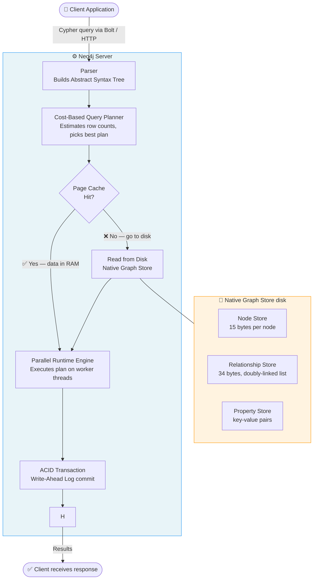
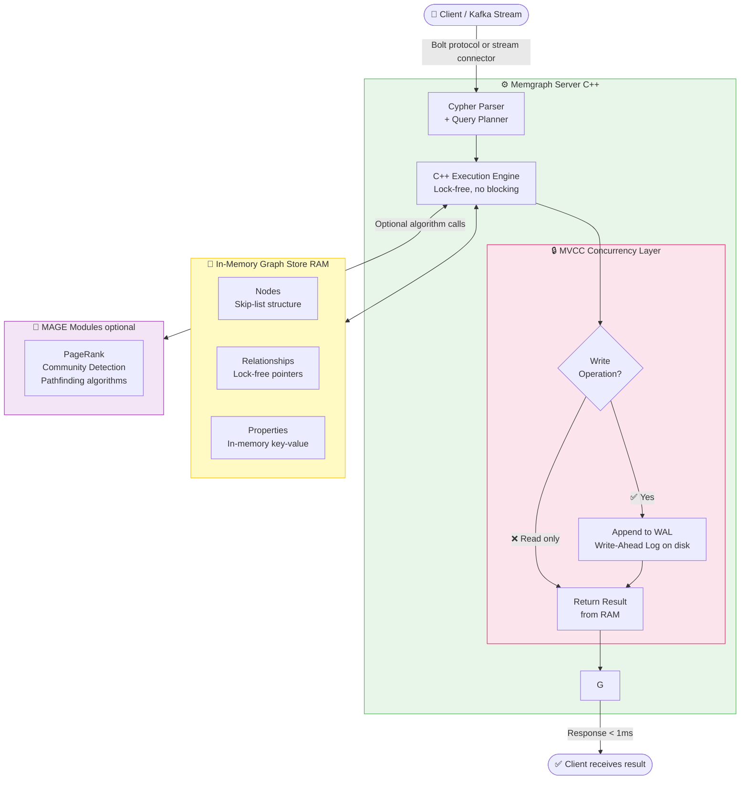
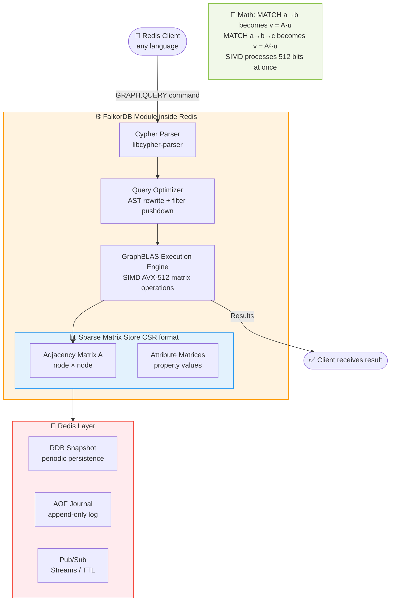
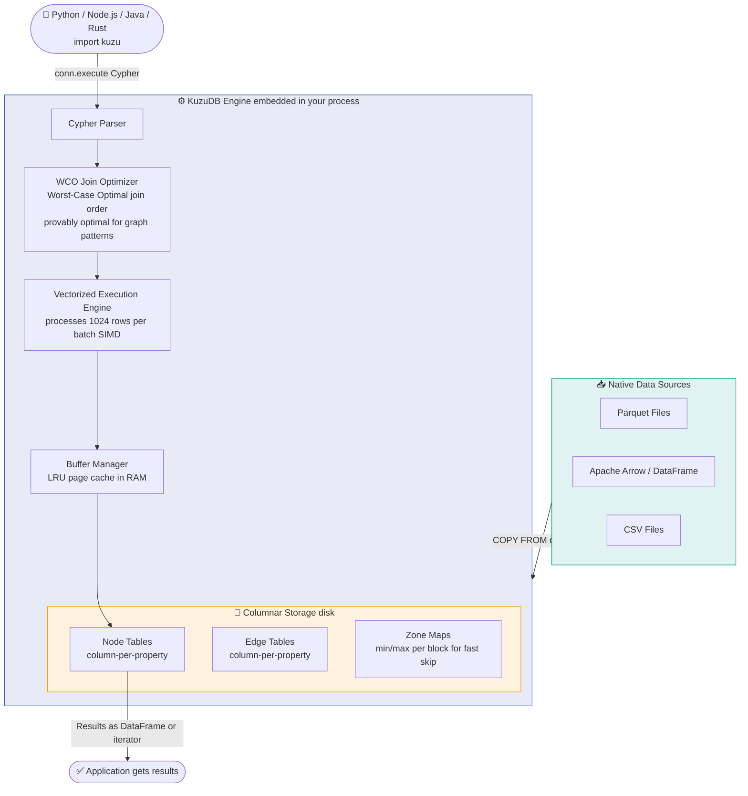
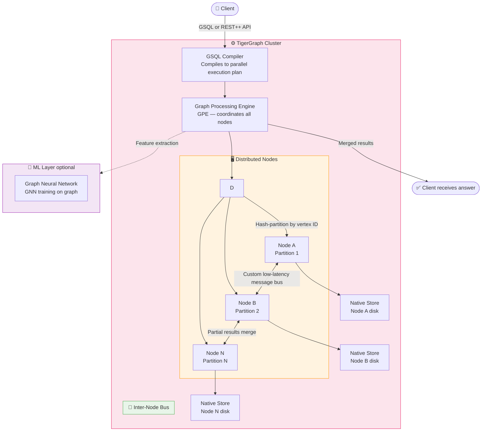
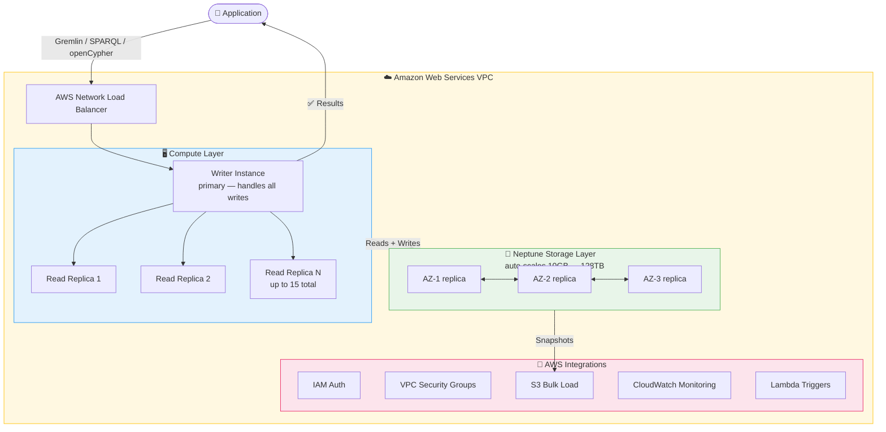
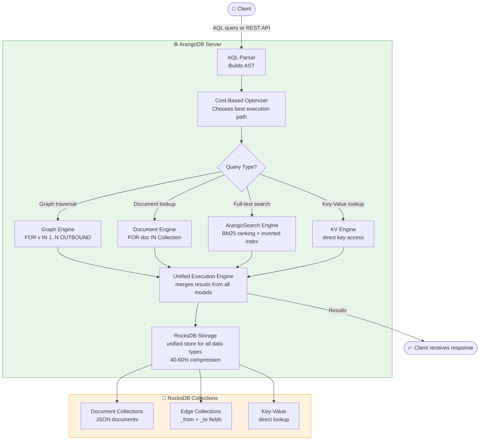
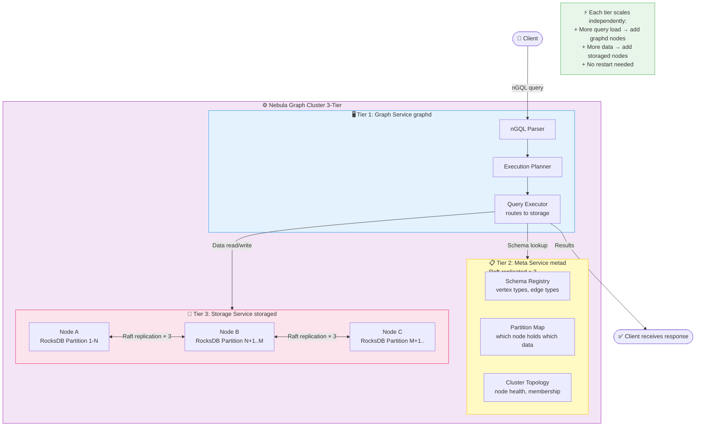
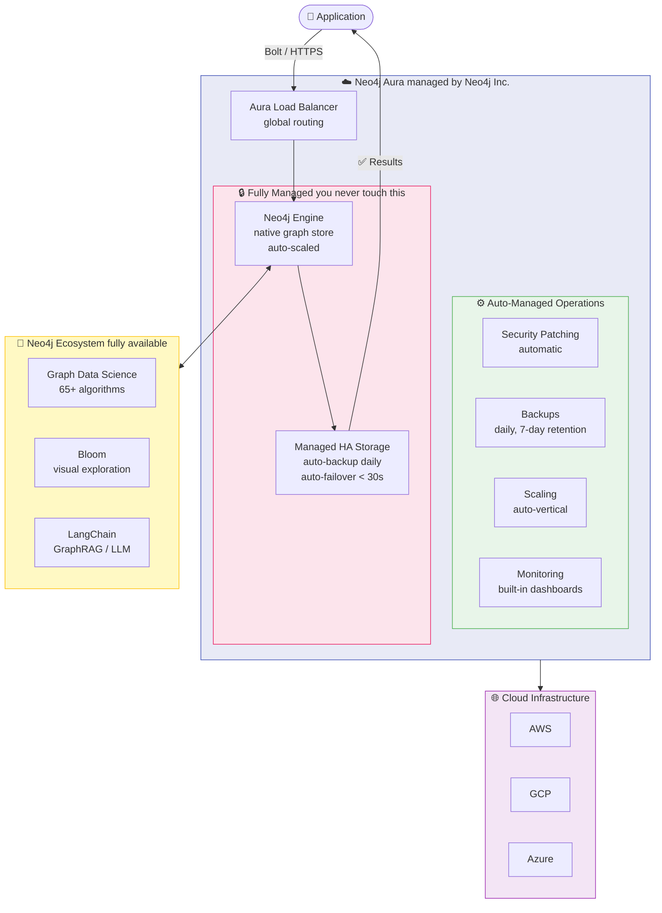
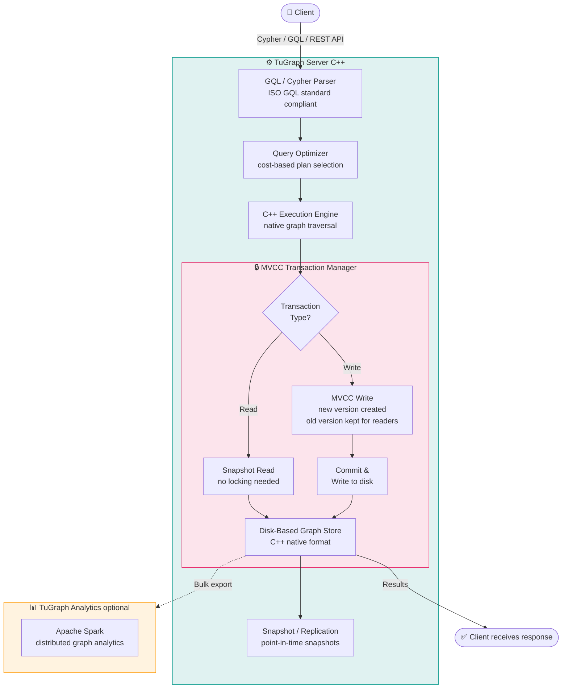

# Top 10 Graph Databases — Ranked, Architecture, Where to Use & Why

> Ranked by: **Performance + Query Optimization + User Friendliness + Overall Production Readiness**
>
> 📌 **Flowcharts use Mermaid** — rendered in VS Code (Markdown Preview Mermaid Support), GitHub, Obsidian, Notion, GitLab.

---

## Ranking Summary

| Rank | Database | Score /40 | One-Line Reason for Rank |
|------|----------|-----------|--------------------------|
| 🥇 1 | **Neo4j** | 37 | Gold standard — best ecosystem, docs, community, and tooling |
| 🥈 2 | **Memgraph** | 36 | Fastest real-time queries — entire graph lives in RAM |
| 🥉 3 | **FalkorDB** | 35 | Blazing matrix-math speed inside Redis with minimal setup |
| 4 | **KuzuDB** | 35 | Best embedded analytical graph DB — no server needed |
| 5 | **TigerGraph** | 34 | Only choice for petabyte-scale deep-link analytics |
| 6 | **Amazon Neptune** | 33 | Best fully managed cloud graph DB on AWS |
| 7 | **ArangoDB** | 33 | Best multi-model DB — graph + document + search in one |
| 8 | **Nebula Graph** | 32 | Purpose-built for 100 billion+ node distributed graphs |
| 9 | **Neo4j Aura** | 31 | Managed Neo4j — zero ops, instant setup |
| 10 | **TuGraph** | 30 | Best open-source ISO GQL-compliant graph DB |

---

## 1. Neo4j 🥇

### Why Rank #1?
Neo4j has been the graph database leader for 15+ years. No other graph database
comes close in ecosystem maturity, documentation quality, community size
(200,000+ developers), and production tooling. Cypher is now an ISO standard.

---

### Architecture & Working Flow



**How it works step by step:**
1. Client sends a Cypher query over the Bolt protocol
2. Parser converts the query text into an Abstract Syntax Tree (AST)
3. Cost-based planner estimates how many rows each plan step produces and picks the cheapest plan
4. Runtime checks the page cache — if hot data is in RAM, disk is skipped entirely
5. If cache misses, data is read from the native graph store on disk
6. Workers execute the plan in parallel threads
7. Writes commit via ACID Write-Ahead Log for durability
8. Results stream back to the client

> **Key insight:** Each node record holds a direct pointer to its first relationship. Traversing one relationship is `O(1)` — no index needed. This is called **index-free adjacency**.

---

### Where to Use
| Use Case | Why Neo4j Fits |
|----------|---------------|
| **Fraud Detection** | Index-free adjacency finds circular transaction rings in milliseconds |
| **Knowledge Graphs** | Deep ontology + relationship modeling with rich metadata |
| **Recommendation Engines** | Collaborative filtering via graph traversal for cold-start users |
| **Identity & Access Management** | Models complex permission hierarchies naturally |
| **Social Networks** | Friend-of-friend queries traverse millions of connections instantly |
| **Drug Interaction Graphs** | Biomedical knowledge graphs with LangChain/LLM integration |

### Why Use It
- **Largest community** — most Stack Overflow answers, tutorials, and courses
- **Best documentation** — official docs, certifications, and video training
- **Graph Data Science (GDS)** — 65+ built-in algorithms (PageRank, Louvain, Node2Vec)
- **Native graph storage** — index-free adjacency makes traversal O(1)
- **Cypher** — most readable graph query language in the world
- **Integrations** — LangChain, LlamaIndex, Kafka, Spark, dbt, and 50+ tools

### Perfect Example
```cypher
MATCH p = (a:Account)-[:SENT*3..6]->(a)
WHERE a.flagged = true
RETURN p LIMIT 100
```
A bank finds circular money-laundering payment rings in milliseconds.

### When NOT to Use
- Graph > 100B nodes → use TigerGraph or Nebula Graph
- Need sub-millisecond real-time latency → use Memgraph
- Need graph + document + search in one query → use ArangoDB

---

## 2. Memgraph 🥈

### Why Rank #2?
Memgraph stores the entire graph in RAM using lock-free C++ data structures.
No disk I/O — ever. Gives 5–120× faster queries than disk-based systems.
100% Cypher-compatible with native Kafka/Pulsar streaming.

---

### Architecture & Working Flow



**How it works step by step:**
1. Data arrives from a Kafka stream or direct Bolt client connection
2. Cypher parser builds a plan; execution engine runs it entirely in RAM
3. Lock-free C++ data structures mean reads never block writers (MVCC)
4. Write operations optionally append to a Write-Ahead Log for crash recovery
5. MAGE algorithm modules (Python/C++) can be called mid-query for PageRank etc.
6. Results return in microseconds — no disk involved at any point

> **Key insight:** Everything lives in RAM. A traversal never touches disk. This is why Memgraph is 5–120× faster than Neo4j for real-time workloads.

---

### Where to Use
| Use Case | Why Memgraph Fits |
|----------|------------------|
| **Real-Time Fraud Scoring** | Sub-millisecond query latency on live transaction streams |
| **Network Intrusion Detection** | Processes millions of packets/sec, detects anomalies instantly |
| **Live Recommendation Engines** | Instant graph traversal as user interacts with the app |
| **IoT Event Graphs** | Ingests sensor events via Kafka, traverses event graphs in real time |
| **Streaming Analytics** | Native Kafka/Pulsar/Redpanda connectors built in |
| **Operational Dashboards** | Real-time graph metrics refreshed every 100ms |

### Why Use It
- **Entire graph in RAM** — no disk I/O, queries complete in microseconds
- **Cypher compatible** — zero learning curve if you know Neo4j
- **Built-in streaming** — native Kafka/Pulsar connectors, unlike Neo4j
- **MAGE modules** — Python/C++ algorithm extensions
- **C++ engine** — no JVM GC pauses unlike Neo4j
- **ACID compliant** — MVCC ensures no dirty reads without blocking

### Perfect Example
A telecom ingests network packet flows via Kafka. Memgraph builds a live
connection graph and runs community detection every 100ms to detect botnets.
Latency from packet to alert: **under 50ms**.

### When NOT to Use
- Graph does not fit in RAM → use Neo4j or ArangoDB
- Need richest ecosystem and tooling → use Neo4j
- Need petabyte scale → use TigerGraph

---

## 3. FalkorDB 🥉

### Why Rank #3?
FalkorDB uses **sparse matrices + GraphBLAS linear algebra** to represent
and query graphs. Traversal = matrix-vector multiplication. Runs inside Redis,
giving you the entire Redis ecosystem (TTL, pub/sub, streams) for free.

---

### Architecture & Working Flow



**How it works step by step:**
1. Client sends `GRAPH.QUERY myGraph "MATCH (a)->(b) RETURN b"` via Redis protocol
2. Cypher parser converts query to AST; optimizer rewrites for efficiency
3. Each graph pattern translates to a matrix operation:
   - Single hop `(a)→(b)` = vector multiply: **v = A · u**
   - 2-hop `(a)→(b)→(c)` = **v = A² · u**
4. GraphBLAS engine executes using CPU SIMD (AVX-512) — 512 bits processed at once
5. Result rows are materialized and returned via Redis protocol
6. Data persists via Redis RDB snapshots and/or AOF journal

> **Key insight:** Graph traversal is matrix multiplication — one of the most CPU-optimized operations in computing. This is why FalkorDB is extremely fast on modern CPUs.

---

### Where to Use
| Use Case | Why FalkorDB Fits |
|----------|------------------|
| **E-commerce Recommendations** | Fast product-to-product traversal inside existing Redis |
| **Session Graphs** | User session data already in Redis — add graph queries instantly |
| **Access Control Graphs** | Permission hierarchy queries via Cypher inside Redis |
| **Lightweight Fraud Detection** | Fast pattern matching without separate graph infrastructure |
| **Caching + Graph Combined** | Single Redis instance handles both cache and graph workloads |
| **Microservice Graphs** | Each microservice queries graph via standard Redis client |

### Why Use It
- **Already use Redis?** — Add graph queries with zero extra infrastructure
- **GraphBLAS speed** — Matrix-vector multiplication is extremely CPU-efficient
- **Cypher support** — Familiar query language, no new syntax to learn
- **Minimal ops** — No separate graph server to manage
- **Low memory footprint** — Sparse matrix CSR format is very compact
- **All Redis features** — TTL, pub/sub, streams, persistence all available

### Perfect Example
```cypher
MATCH (u:User {id:$uid})-[:BOUGHT]->(p:Product)
      <-[:BOUGHT]-(other)-[:BOUGHT]->(rec)
WHERE NOT (u)-[:BOUGHT]->(rec)
RETURN rec.name, count(*) AS score
ORDER BY score DESC LIMIT 10
```

### When NOT to Use
- Graph does not fit in Redis memory → use Neo4j or TigerGraph
- Need streaming ingestion → use Memgraph
- Need schema enforcement → use Neo4j or ArangoDB

---

## 4. KuzuDB

### Why Rank #4?
KuzuDB is the **DuckDB of graph databases** — an embedded analytical engine
with no server. Uses the Worst-Case Optimal (WCO) join algorithm and
vectorized columnar execution. Best for data scientists in Python notebooks.

---

### Architecture & Working Flow



**How it works step by step:**
1. Application imports KuzuDB as a library — no server, no Docker, no ports
2. Cypher query is parsed into a logical plan
3. WCO optimizer reorders joins to guarantee worst-case optimal complexity
4. Vectorized engine processes 1024 rows per batch using SIMD instructions
5. Buffer manager keeps hot column pages in RAM (LRU cache)
6. Zone maps on disk allow blocks to be skipped when min/max values rule out matches
7. Results returned as Python DataFrame, Arrow table, or row iterator

> **Key insight:** WCO (Worst-Case Optimal) joins are a breakthrough from database theory — they guarantee the join order is optimal regardless of graph shape. No other graph DB uses this.

---

### Where to Use
| Use Case | Why KuzuDB Fits |
|----------|----------------|
| **Citation Graph Analysis** | Load Parquet files directly, run Cypher in Jupyter |
| **ETL Graph Pipelines** | Embed graph transformations inside Python/Spark pipelines |
| **Offline Knowledge Graph Analytics** | No server needed — just `import kuzu` |
| **Graph ML Feature Engineering** | Extract structural features as training inputs |
| **Local Development** | Fastest way to prototype a graph model with zero infrastructure |
| **Research & Experiments** | Academic graph analysis without cluster setup |

### Why Use It
- **No server** — embedded library, works in any Python/Node/Java process
- **WCO join optimizer** — provably optimal query planning
- **Parquet/Arrow native** — loads DataFrames and Parquet files directly
- **Columnar storage** — 5–10× compression vs row-based
- **Cypher** — same language as Neo4j and Memgraph
- **MIT open source** — no licence restrictions

### Perfect Example
```python
import kuzu
db   = kuzu.Database("graph.db")
conn = kuzu.Connection(db)
conn.execute("COPY Paper FROM 'papers.parquet'")
conn.execute("COPY Cites FROM 'cites.parquet'")
result = conn.execute("""
    MATCH (a:Paper)-[:Cites*1..3]->(b)
    RETURN b.venue, count(*) AS influence
    ORDER BY influence DESC LIMIT 20
""")
```

### When NOT to Use
- Need a network-accessible server → use Neo4j or Memgraph
- Need high-frequency writes (OLTP) → use Neo4j or Memgraph
- Need distributed scale → use TigerGraph or Nebula Graph

---

## 5. TigerGraph

### Why Rank #5?
TigerGraph is the only graph DB purpose-built for **petabyte-scale parallel
deep-link analytics**. GSQL is Turing-complete and compiles to a distributed
execution plan that runs on all cluster nodes simultaneously.

---

### Architecture & Working Flow



**How it works step by step:**
1. Client sends GSQL query or REST++ API call
2. GSQL compiler converts the query to a distributed execution plan
3. Graph Processing Engine broadcasts the plan to all cluster nodes simultaneously
4. Each node processes only its own partition of the graph in parallel
5. Nodes exchange partial results via a custom low-latency inter-node message bus
6. Partial results are merged back at the GPE level
7. Optional: ML layer extracts graph features for GNN training without data export

> **Key insight:** All N nodes execute simultaneously. A 10-node cluster runs the same query 10× faster than a single node — true linear scalability for graph workloads.

---

### Where to Use
| Use Case | Why TigerGraph Fits |
|----------|-------------------|
| **Enterprise Fraud Detection** | 10+ hop traversal across 500B transactions in < 2 seconds |
| **Supply Chain Risk** | Betweenness centrality across 200M supplier relationships |
| **Anti-Money Laundering** | Deep pattern matching at petabyte scale in real time |
| **Recommendation at Scale** | 100B+ user-product graph with real-time personalization |
| **Graph Neural Networks** | Built-in GNN support and ML pipeline integration |
| **Cybersecurity Threat Graphs** | APT attack path analysis across massive network graphs |

### Why Use It
- **MPP architecture** — all cluster nodes execute queries in parallel
- **GSQL** — Turing-complete, write custom graph algorithms as queries
- **Deepest traversal** — 10+ hop real-time queries no other DB handles
- **Built-in GNN** — train Graph Neural Networks without exporting data
- **Petabyte scale** — only graph DB tested at true petabyte scale
- **HTAP** — handles both transactional and analytical workloads

### Perfect Example
500 billion payment transactions stored as graph edges. TigerGraph detects
10-hop money laundering cycles in under 2 seconds — hours in PostgreSQL.

### When NOT to Use
- Small-to-medium graphs → use Neo4j (GSQL learning curve not worth it)
- Quick proof-of-concept → use Neo4j Aura
- Need open-source → use TuGraph or ArangoDB

---

## 6. Amazon Neptune

### Why Rank #6?
Amazon Neptune is fully managed on AWS. Auto-scales from 10 GB to 128 TB
with 6-way replication across 3 AZs. Supports Gremlin, SPARQL, and
openCypher on the same data. Zero operational overhead.

---

### Architecture & Working Flow



**How it works step by step:**
1. Application sends query via Gremlin, SPARQL, or openCypher — same graph data
2. AWS NLB routes writes to the single writer instance, reads to replicas
3. Writer replicates every write to the Neptune storage layer — 6 copies across 3 AZs
4. Storage auto-scales in 10 GB increments — no manual capacity planning ever
5. If writer fails, a read replica is promoted automatically (< 30 sec failover)
6. S3 bulk load imports millions of triples/edges at high speed
7. All traffic stays inside VPC — no public internet exposure by default

> **Key insight:** Storage and compute are separated. You can scale read replicas without adding storage, and storage grows automatically without touching compute.

---

### Where to Use
| Use Case | Why Neptune Fits |
|----------|-----------------|
| **Healthcare Knowledge Graphs** | HIPAA-compliant out of the box |
| **Financial Compliance Graphs** | PCI-DSS and SOC2 automatically |
| **Identity Graphs on AWS** | Deep IAM/VPC integration for security |
| **Government Data Graphs** | FedRAMP High certification available |
| **Multi-language Graph APIs** | Same data queried via Gremlin, SPARQL, or Cypher |
| **Serverless Event-Driven Graphs** | Native AWS Lambda + Neptune integration |

### Why Use It
- **Zero ops** — backups, patching, failover, scaling all automatic
- **Compliance included** — HIPAA, PCI-DSS, SOC2, FedRAMP, ISO 27001
- **Multi-query language** — Gremlin + SPARQL + openCypher on same graph
- **AWS native** — S3 bulk load, IAM auth, VPC security, CloudWatch
- **6-way replication** — near-zero data loss risk
- **128 TB storage** — auto-scales with no capacity planning

### Perfect Example
A healthcare insurer builds a patient-provider-claim graph on Neptune.
HIPAA compliance is automatic. Zero DB admins needed. AWS handles all
backups, patching, and failover automatically.

### When NOT to Use
- Not on AWS → use Neo4j or ArangoDB
- Need local development → use Neo4j (Neptune has no local emulator)
- Need petabyte-scale deep analytics → use TigerGraph

---

## 7. ArangoDB

### Why Rank #7?
ArangoDB is the best **multi-model database** — graph + document + key-value
+ full-text search in one system, one query language (AQL), one storage engine
(RocksDB). Replaces Neo4j + MongoDB + Elasticsearch with a single binary.

---

### Architecture & Working Flow



**How it works step by step:**
1. Client sends an AQL query — one language for graph, document, KV, and search
2. Parser builds an AST; optimizer evaluates multiple execution plans and picks cheapest
3. Query is routed to the appropriate engine (graph, document, search, or KV)
4. The unified execution engine merges results from multiple engines in one query pass
5. ArangoSearch uses an inverted index with BM25 ranking for full-text queries
6. All data lands in RocksDB — one storage engine for all data types
7. RocksDB's LSM-tree compression reduces disk usage by 40–60%

> **Key insight:** A single AQL query can do full-text search AND graph traversal simultaneously — impossible in any other single database. This replaces 3 separate systems.

---

### Where to Use
| Use Case | Why ArangoDB Fits |
|----------|------------------|
| **E-commerce Catalog + Graph** | Products as documents, suppliers as graph edges, sessions as KV |
| **Network Topology + Config** | Network as graph, device configs as documents — one query |
| **Content Recommendation** | Article graph + full-text search in a single AQL query |
| **Logistics Optimization** | Routes as graph + shipment records as documents |
| **CMS with Relationships** | Content nodes + tag hierarchies + permission graphs |
| **API Backend with Graph** | Replace MongoDB + Neo4j + Elasticsearch with one system |

### Why Use It
- **Multi-model** — graph + document + KV + full-text search in one DB
- **AQL expressiveness** — join graph traversal with document queries and search
- **No extra infrastructure** — replaces 3 databases with one system
- **RocksDB storage** — proven, battle-tested, 40–60% compression
- **Free and open source** — no feature gating in Community Edition
- **Local development** — single binary, works perfectly on a laptop

### Perfect Example
```aql
FOR doc IN FULLTEXT(Products, "name", "laptop")
  FOR v IN 1..2 OUTBOUND doc SuppliedBy
    FILTER v.region == "EU"
    RETURN DISTINCT doc
```
Full-text search + graph traversal in one query.

### When NOT to Use
- Need pure graph performance → use Neo4j or Memgraph
- Need petabyte graph scale → use TigerGraph or Nebula Graph
- Fully on AWS and want zero ops → use Amazon Neptune

---

## 8. Nebula Graph

### Why Rank #8?
Nebula Graph was purpose-built for **internet-scale graphs with 100B+ nodes**.
Its 3-tier architecture separates Graph Service, Meta Service, and Storage
Service so each scales independently. Used by Tencent and JD.com at extreme scale.

---

### Architecture & Working Flow



**How it works step by step:**
1. Client sends nGQL query to any Graph Service (graphd) node
2. graphd parses query and consults Meta Service for schema and partition map
3. Meta Service tells graphd which Storage Service nodes hold the required partitions
4. graphd routes sub-queries to the correct storaged nodes in parallel
5. Each storaged node holds its RocksDB partitions — 3-way Raft replicated
6. storaged nodes execute local traversals and return partial results
7. graphd merges partial results and returns to client
8. If a storaged node fails, Raft automatically elects a new leader from its replicas

> **Key insight:** Storage, metadata, and query processing are completely separated. Scale them independently — no coupling, no redeployment.

---

### Where to Use
| Use Case | Why Nebula Fits |
|----------|----------------|
| **Social Network at Scale** | 100B+ user nodes, friend-of-friend in under 100ms |
| **Internet-Scale Recommendations** | Product graph with billions of user-item edges |
| **Large-Scale Knowledge Graph** | Distributed knowledge base with 10B+ facts |
| **Ad Targeting Graphs** | Billion-node user-interest-ad traversal |
| **Gaming Social Graphs** | Massive player-to-player relationship graphs |
| **National-Scale ID Graphs** | Government or telco identity graphs at country scale |

### Why Use It
- **3-tier separation** — storage, compute, and metadata scale independently
- **100B+ nodes** — only distributed open-source graph DB proven at this scale
- **C++ native** — no JVM overhead, very efficient CPU and memory
- **Raft replication** — 3-replica fault tolerance built in
- **Linear horizontal scaling** — add storage nodes without adding query nodes
- **Apache 2.0 open source** — free at any scale

### Perfect Example
Tencent stores the WeChat social graph (100B+ users) in Nebula Graph.
Friend-of-friend queries traverse 3 hops in under 100ms across billions of nodes.

### When NOT to Use
- Graph < 1 billion nodes → use Neo4j (simpler, better ecosystem)
- Need English community and docs → use Neo4j or ArangoDB
- Need multi-model → use ArangoDB

---

## 9. Neo4j Aura

### Why Rank #9?
Neo4j Aura is the **fully managed cloud version of Neo4j** on AWS/GCP/Azure.
Ranks 9th (not 1st) because it is a managed service with less control and
higher cost at scale — but for teams wanting zero administration it is perfect.

---

### Architecture & Working Flow



**How it works step by step:**
1. Application connects to Aura endpoint via Bolt protocol — same as self-hosted Neo4j
2. Aura load balancer routes the connection to the correct managed instance
3. Neo4j Engine processes the Cypher query using the native graph store
4. All infrastructure operations (patching, backups, scaling, failover) run automatically
5. Backups happen daily with 7-day retention — no configuration needed
6. GDS algorithms, Bloom visualization, and LangChain integration work out of the box
7. Zero JVM tuning, zero OS configuration, zero database administration

> **Key insight:** You get 100% of Neo4j's capabilities — GDS, Bloom, LangChain — without managing a single server.

---

### Where to Use
| Use Case | Why Aura Fits |
|----------|--------------|
| **Startup Knowledge Graphs** | Provision in 60 seconds, no DevOps needed |
| **Proof-of-Concept Projects** | Free tier (200K nodes) for rapid prototyping |
| **Small Teams without DBA** | Neo4j fully managed — no tuning, patching, or backups |
| **LLM + Graph RAG Apps** | Best LangChain/LlamaIndex integration of any graph DB |
| **Drug Interaction Graphs** | SOC2-certified, connects to healthcare NLP pipelines |
| **Quick Production Launch** | Production-ready graph DB in under 5 minutes |

### Why Use It
- **Zero ops** — Neo4j Inc. handles everything
- **Instant setup** — working graph DB in under 60 seconds
- **Full Neo4j ecosystem** — GDS algorithms, Bloom visualization, all plugins
- **SOC2 + GDPR** — compliance certifications included
- **LLM integration** — best GraphRAG support via LangChain
- **Free tier** — AuraFree gives 200K nodes permanently free

### Perfect Example
A 5-person startup builds a drug interaction knowledge graph on AuraDB
Professional. They connect LangChain + GPT-4 for natural language queries
and go to production — no DevOps, no server management, no JVM tuning.

### When NOT to Use
- Need full control over infrastructure → use self-hosted Neo4j
- Cost-sensitive at large scale → self-hosted Neo4j or TuGraph
- Need petabyte scale → use TigerGraph

---

## 10. TuGraph

### Why Rank #10?
TuGraph is actually very fast (86M+ ops/sec on LDBC benchmarks) but ranks
10th due to its small English community and limited tooling ecosystem outside
Ant Group. It is the **best fully open-source ISO GQL-compliant graph DB**
for financial and risk-control applications.

---

### Architecture & Working Flow



**How it works step by step:**
1. Client sends a Cypher or ISO GQL query via REST or native protocol
2. Parser validates against the GQL standard; optimizer picks execution plan
3. C++ engine executes the traversal natively — no JVM overhead
4. MVCC Transaction Manager handles concurrency:
   - **Reads** get a consistent snapshot — no locks needed, never blocked
   - **Writes** create a new version of modified data; old versions serve concurrent readers
5. Committed writes go to the disk-based graph store in C++ native binary format
6. Snapshots enable point-in-time recovery and replication
7. Optional: bulk export to Apache Spark for distributed analytical workloads

> **Key insight:** MVCC means readers and writers never block each other. Ant Group's Alipay runs 1B+ users through this system for real-time payment risk scoring.

---

### Where to Use
| Use Case | Why TuGraph Fits |
|----------|-----------------|
| **Financial Risk Scoring** | Built at Ant Group/Alipay for real-time payment risk |
| **Anti-Fraud Traversal** | 5-hop transaction network traversal in under 10ms |
| **ISO GQL Standard Projects** | First DB with full ISO GQL compliance |
| **Open-Source Requirement** | Apache 2.0, fully open, no licence cost |
| **C++ Performance Requirement** | Faster than JVM-based Neo4j for raw throughput |
| **Self-Hosted on a Budget** | No licence cost, high performance, production-ready |

### Why Use It
- **ISO GQL standard** — future-proof query language compliance
- **C++ + MVCC** — fast transactions with snapshot isolation
- **Apache 2.0** — completely free, no enterprise licence needed
- **86M+ ops/sec** — LDBC benchmark performance exceeds many paid alternatives
- **Ant Group proven** — battle-tested at Alipay scale (1B+ users)
- **AES-256 + RBAC** — enterprise-grade security built in

### Perfect Example
Ant Group (Alipay) uses TuGraph for real-time payment risk scoring.
A transaction triggers a graph query traversing 5 hops (10M edges) in under
10ms, computing a risk score from connection patterns to known fraudulent accounts.

### When NOT to Use
- Need a large English community → use Neo4j
- Need managed cloud service → use Neo4j Aura or Amazon Neptune
- Need streaming → use Memgraph

---

## Quick Decision Guide

```
What do you need?

→ Best all-rounder with biggest community       = Neo4j
→ Fastest real-time (sub-ms) + streaming        = Memgraph
→ Already using Redis, need graph               = FalkorDB
→ Embedded analytics in Python (no server)      = KuzuDB
→ Petabyte scale + deep link analytics          = TigerGraph
→ AWS-native + zero ops + compliance            = Amazon Neptune
→ Graph + Document + Search in one DB           = ArangoDB
→ 100B+ nodes distributed self-managed          = Nebula Graph
→ Neo4j but zero setup (managed cloud)          = Neo4j Aura
→ Free open-source + ISO GQL + C++ speed        = TuGraph
```

---

## Why This Ranking Order?

| Comparison | Winner | Key Reason |
|------------|--------|------------|
| Neo4j vs Memgraph | **Neo4j** | 15 years ecosystem vs speed advantage |
| Memgraph vs FalkorDB | **Memgraph** | Richer algorithm support + streaming |
| FalkorDB vs KuzuDB | **FalkorDB** | Better OLTP; KuzuDB is OLAP-only |
| KuzuDB vs TigerGraph | **KuzuDB** | Easier to use; TigerGraph needs cluster |
| TigerGraph vs Neptune | **TigerGraph** | Deeper analytics; Neptune is zero-ops |
| Neptune vs ArangoDB | **Neptune** | Zero ops + compliance vs flexibility |
| ArangoDB vs Nebula | **ArangoDB** | Multi-model + English docs vs raw scale |
| Nebula vs Aura | **Nebula** | 100B+ nodes vs managed convenience |
| Aura vs TuGraph | **Neo4j Aura** | Ecosystem + compliance vs open-source |

---


