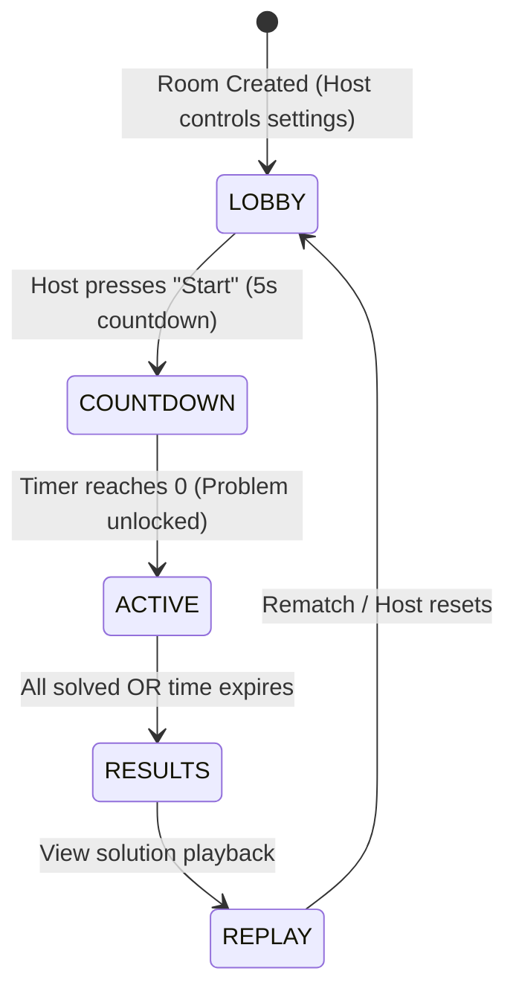
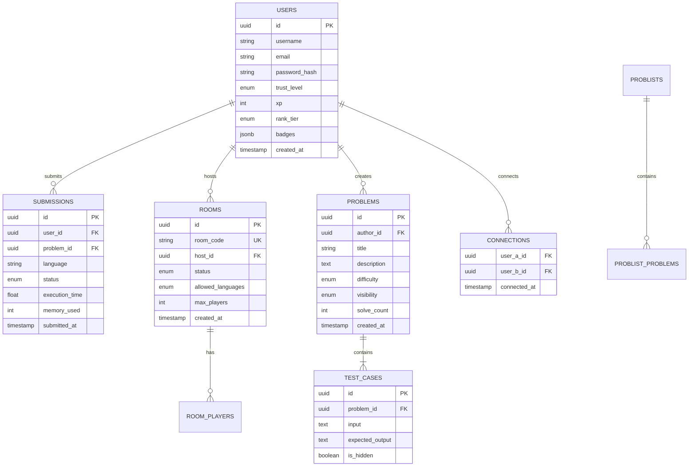

# CodeBattle — System Design & Security Architecture

> A comprehensive system design, security model, and implementation blueprint for building a secure, real-time, multi-language competitive coding platform.

---

## Table of Contents

1. [System Architecture Overview](#1-system-architecture-overview)
2. [Security Architecture & Threat Model](#2-security-architecture--threat-model)
3. [Component Breakdown](#3-component-breakdown)
   - [Frontend Architecture](#frontend-architecture)
   - [API Gateway & Authentication](#api-gateway--authentication)
   - [Real-Time WebSocket Engine](#real-time-websocket-engine)
   - [Secure Code Execution Sandbox](#secure-code-execution-sandbox)
   - [AI Hint Engine](#ai-hint-engine)
4. [Database & Data Schema](#4-database--data-schema)
5. [Anti-Cheat & Trust Mechanics](#5-anti-cheat--trust-mechanics)
6. [Scalability & Infrastructure Blueprint](#6-scalability--infrastructure-blueprint)
7. [Implementation Roadmap (Phase 1 to Phase 3)](#7-implementation-roadmap)

---

## 1. System Architecture Overview

CodeBattle operates on an event-driven, decoupled microservices architecture designed to separate **high-concurrency web & WebSocket traffic** from **untrusted code execution workloads**.

```mermaid
flowchart TB
    subgraph Client Layer
        WebClient["Web Browser (React/Next.js + Monaco Editor)"]
        MobileClient["Mobile / Tablet Browser"]
    end

    subgraph Edge & Gateway Layer
        CF["Cloudflare (DNS / WAF / DDoS Protection)"]
        LB["Nginx / Traefik Reverse Proxy"]
    end

    subgraph Application Core Services
        API["API Gateway / App Server (Node.js/Next.js)"]
        WS["WebSocket Gateway (Socket.io + Redis Adapter)"]
        Auth["Auth Service (OAuth2 / JWT)"]
    end

    subgraph Data & Messaging Layer
        Redis["Redis (Room State, Pub/Sub, Rate Limiting)"]
        DB[(PostgreSQL Primary DB)]
        Queue["Message Queue (BullMQ / RabbitMQ)"]
    end

    subgraph Execution Layer (Isolated Sandbox)
        Worker["Sandbox Queue Workers"]
        Judge0["Judge0 / gVisor Container Cluster"]
        Docker1["Isolated Container (Python / JS / C++)"]
        Docker2["Isolated Container (Rust / Go / Java)"]
    end

    subgraph AI Layer
        LLM["AI Hint Service (OpenAI / Gemini API)"]
    end

    Client Layer -->|HTTPS / WSS| CF
    CF --> LB
    LB --> API
    LB --> WS

    API <--> Auth
    API <--> Redis
    API <--> DB
    API --> Queue

    WS <--> Redis
    
    Queue --> Worker
    Worker --> Judge0
    Judge0 --> Docker1
    Judge0 --> Docker2

    API --> LLM
```

---

## 2. Security Architecture & Threat Model

Running user-submitted code in 10 different languages introduces extreme security risks. Below is the multi-layered security model built to mitigate vulnerabilities.

### Threat Model & Mitigations

| Threat Vector | Attack Description | Mitigation Strategy |
| :--- | :--- | :--- |
| **Remote Code Execution (RCE)** | User submits malicious code attempting to read environment variables, host filesystem, or attack external servers. | **Isolated Micro-VMs / Containers**: Execution runs inside `gVisor` / `seccomp` restricted Docker containers with read-only root filesystems and zero network egress (`--net=none`). |
| **Fork Bomb / Resource Exhaustion** | Code creates infinite sub-processes, allocating massive CPU/RAM to crash host node. | **Linux cgroups & rlimits**: Strict limit of N processes (pids_limit=64), RAM capped at 256MB per run, CPU time capped at 2.0s per test case. |
| **Network Exfiltration / Port Scanning** | Code attempts to contact internal network services (PostgreSQL, Redis) or external C2 servers. | **Network Namespace Isolation**: Virtual interfaces are completely disabled inside execution containers. No outbound traffic allowed. |
| **Cross-Site Scripting (XSS)** | Malicious HTML/JS in problem descriptions, user profiles, or room names. | **Strict Sanitization & CSP**: DOMPurify for HTML rendering, strict Content Security Policy (`script-src 'self'`), no `eval()` allowed in client space. |
| **DDoS & Room Flooding** | Botnet creating thousands of WebSocket rooms or flooding API with submissions. | **Cloudflare WAF + Redis Token Bucket**: Rate limit to 10 API submissions per minute per IP/user, max 1 open room per free tier account. |
| **SQL Injection / Data Theft** | Malicious database parameter manipulation. | **Parameterized Queries & ORM**: Prisma ORM with strict type-safety and parameterized SQL queries. |
| **Cross-Site Request Forgery (CSRF)** | Unauthorized actions performed on behalf of authenticated users. | **SameSite HTTP-Only Cookies + Anti-CSRF Tokens**. |

---

## 3. Component Breakdown

### Frontend Architecture
* **Framework:** Next.js (App Router) + TypeScript.
* **Code Editor:** `@monaco-editor/react` (VS Code engine) preconfigured for 10 languages with auto-formatting, custom dark themes, and custom keybindings.
* **State & Sync:** Zustand for local client state + Socket.io-client for real-time room events.
* **UI & Styling:** Vanilla CSS / Modern Tailwind CSS design tokens with custom glassmorphism and modern responsive UI.

### API Gateway & Authentication
* **Auth Protocol:** JWT stored in `HttpOnly`, `Secure`, `SameSite=Strict` cookies. OAuth2 providers (GitHub, Google) for 1-click developer onboarding.
* **RBAC & Trust Matrix:**
  * `Guest / New User`: Join rooms, solve public problems, create private rooms.
  * `Verified User` (Email verified + 10 solves): Publish public problems, create public rooms.
  * `Trusted User` (50+ solves + high accuracy): Review community flags, edit problem tags.
  * `Admin / Moderator`: System configuration, ban management, audit log access.

### Real-Time WebSocket Engine
* **Protocol:** WebSockets with auto-reconnection & ping/pong heartbeats.
* **Scalability:** Horizontal scaling using Node.js cluster mode and `@socket.io/redis-adapter` for multi-server synchronization.
* **Room State Machine:**



### Secure Code Execution Sandbox
* **Engine choice:** **Judge0 CE** (Self-hosted) or custom **gVisor Docker sandbox runner**.
* **Execution Workflow:**
  1. Client sends submission `(problem_id, language_id, source_code)` via API.
  2. API validates schema, checks rate limits, and pushes job to Redis Queue (BullMQ).
  3. Worker pulls job and invokes Judge0 container via isolated HTTP RPC.
  4. Judge0 spins up an ephemeral container with strict resource limits:
     * CPU Time Limit: `2.0 seconds`
     * Memory Limit: `256 MB`
     * Process Limit: `64 pids`
     * Network: `Disabled (--net=none)`
     * Filesystem: `Read-only except /tmp`
  5. Test cases executed sequentially. Results returned: `Time (ms)`, `Memory (KB)`, `Status (Accepted / WA / TLE / MLE / CE)`.
  6. Score calculated; event emitted to WebSocket room for live leaderboard update.

### AI Hint Engine
* **Integration:** OpenAI GPT-4o-mini or Google Gemini 1.5 Flash.
* **Guardrail Prompting:**
  ```text
  SYSTEM PROMPT: You are a competitive coding coach. The user is stuck on a coding challenge.
  ANALYSIS OBJECTIVE: Review the problem, user's current code, and failed test cases.
  STRICT RULES:
  1. DO NOT provide any syntax or code snippet solutions.
  2. Provide a 1-2 sentence high-level algorithmic hint (e.g., "Consider using a two-pointer technique to reduce time complexity to O(N)").
  3. Keep the tone encouraging and analytical.
  ```

---

## 4. Database & Data Schema

PostgreSQL is the single source of truth for persistent data, paired with Redis for volatile cache & real-time room sessions.



---

## 5. Anti-Cheat & Trust Mechanics

To maintain competitive integrity during public rooms and tournaments:

1. **Paste & Clipboard Monitor:** Detect sudden large insertions into Monaco Editor (logs clipboard events; flags 200+ char instant pastes).
2. **AST (Abstract Syntax Tree) Similarity Engine:** For top tournament rounds, parse submitted code ASTs to detect identical algorithmic structure between concurrent participants.
3. **Focus Loss Tracker:** Track window blur/focus events during room rounds to flag tab switching.
4. **Community Moderation System:**
   * Automated auto-hide if a problem receives 10+ abuse/broken flags.
   * Trusted tier users vote on flag resolutions with full audit trail logging.

---

## 6. Scalability & Infrastructure Blueprint

```
                     ┌───────────────────────────┐
                     │   Cloudflare Anycast IP   │
                     └─────────────┬─────────────┘
                                   │
                     ┌─────────────▼─────────────┐
                     │    Nginx Ingress / ALB    │
                     └─────────────┬─────────────┘
                                   │
            ┌──────────────────────┴──────────────────────┐
            │                                             │
┌───────────▼───────────┐                     ┌───────────▼───────────┐
│ Next.js Web/API Nodes │                     │ WebSocket Nodes (WS)  │
│    (Auto-scaled)      │                     │     (Auto-scaled)     │
└───────────┬───────────┘                     └───────────┬───────────┘
            │                                             │
            └──────────────────────┬──────────────────────┘
                                   │
                      ┌────────────▼────────────┐
                      │   Redis Cluster (v7)    │
                      │  (State, Pub/Sub, Queues)│
                      └────────────┬────────────┘
                                   │
       ┌───────────────────────────┼───────────────────────────┐
       │                           │                           │
┌──────▼──────────────┐  ┌─────────▼─────────────┐  ┌──────────▼───────────┐
│ PostgreSQL Primary  │  │ BullMQ Worker Nodes │  │ Judge0 Execution   │
│ (RDS / Managed PG)  │  │ (Job Processors)    │  │ Pool (Docker Nodes)│
└─────────────────────┘  └──────────────────────┘  └─────────────────────┘
```

### Resource Management Strategy
* **Web & API Nodes:** Serverless / Containerized (AWS ECS, GCP Cloud Run, or Kubernetes).
* **WebSocket Nodes:** Stateful instances with sticky sessions (Node.js + Redis Adapter).
* **Sandbox Worker Cluster:** Dedicated EC2 instances / bare-metal nodes with Docker engine privileges for maximum isolation and CPU consistency.

---

## 7. Implementation Roadmap

### Phase 1: Core Foundation (MVP)
- [x] Project architecture & security design document (`system_design.md`).
- [ ] Initialize Next.js + TypeScript + Tailwind repository.
- [ ] Implement User Auth (OAuth + JWT HttpOnly cookies).
- [ ] Setup Monaco Editor component for Python & JavaScript.
- [ ] Integrate self-hosted Judge0 / Piston execution backend.
- [ ] Build WebSocket room lobby & live countdown timer.

### Phase 2: Platform & Social Features
- [ ] Expand language sandbox support to all 10 target languages.
- [ ] Implement Problem Publishing UI & hidden test case validator.
- [ ] Mutual Connection & QR Code connection system.
- [ ] Problist creation & sharing.
- [ ] AI Hint integration (OpenAI / Gemini API).

### Phase 3: Monetization & B2B
- [ ] Stripe Webhook integration for Premium subscription tiers.
- [ ] Replay Engine (Playback room submissions step-by-step).
- [ ] Interview Mode (Dual editor video/code synchronization).
- [ ] Organization dashboards & custom branded room portals.

---
*System Design Document Version: 1.0 — Security & System Architecture Blueprint*
